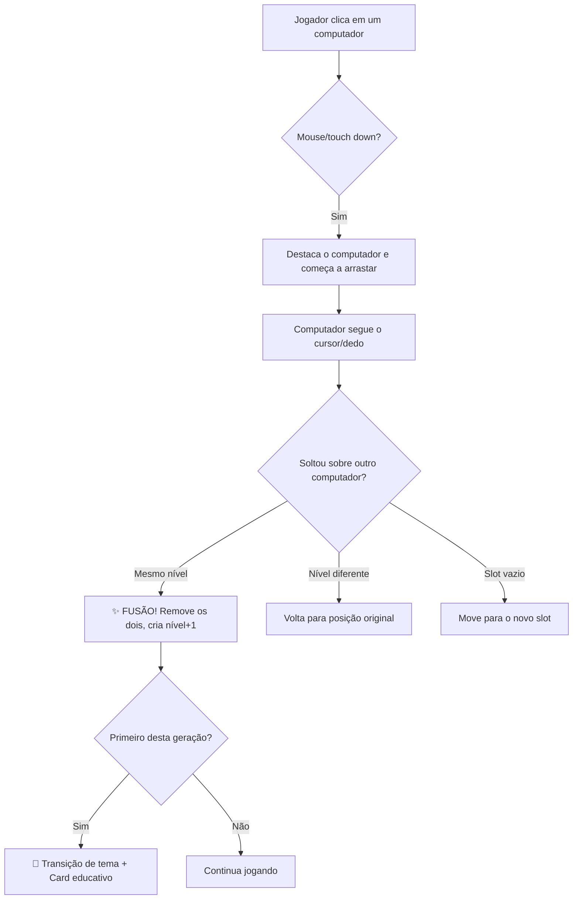
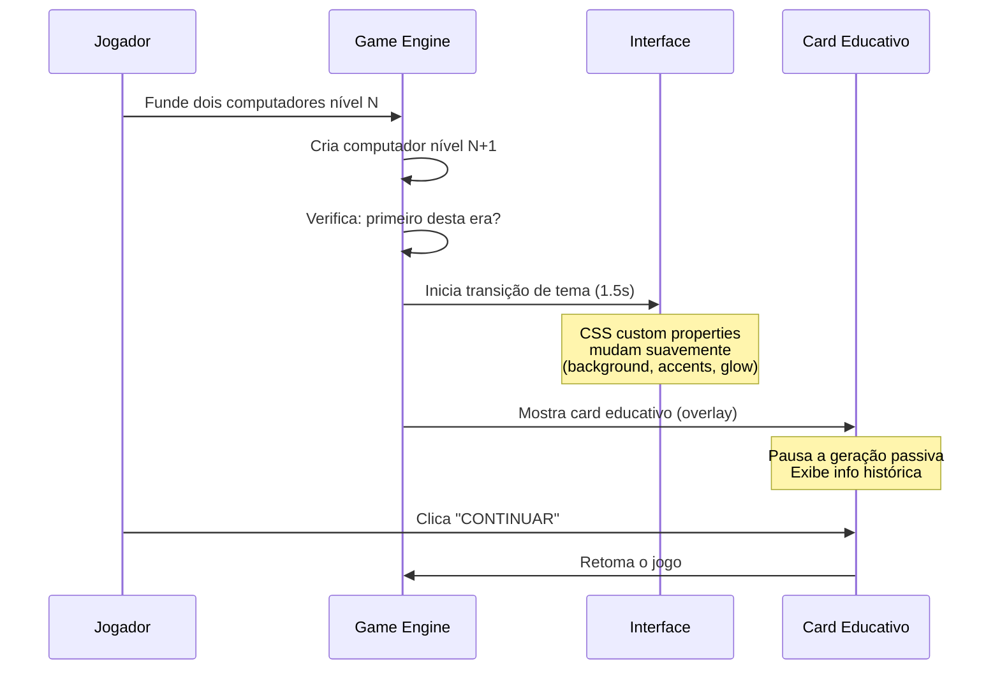

# 🖥️ Corrida pela Miniaturização — Plano de Implementação

Jogo estilo **Cow Evolution** (clicker + fusão em grid) ambientado na história da miniaturização dos computadores. O jogador funde computadores de diferentes gerações numa grade, progredindo das válvulas até a nanotecnologia.

---

## Mockups de Referência Visual

````carousel

<!-- slide -->

````

---

## 1. Stack Tecnológica

| Camada | Tecnologia | Justificativa |
|:---|:---|:---|
| **Estrutura** | HTML5 | Semântico, SEO, acessibilidade |
| **Renderização** | HTML5 Canvas (2D) | Performance para sprites, animações e drag-and-drop |
| **Lógica** | Vanilla JavaScript (ES Modules) | Zero dependências, fácil manutenção |
| **Estilo da UI** | Vanilla CSS | Controle total sobre glassmorphism, transições de tema |
| **Áudio** | Web Audio API | Sons de fusão, clique, desbloqueio de era |
| **Persistência** | localStorage | Salvar progresso do jogador entre sessões |
| **Servidor local** | Live Server (VS Code) | Sem build step — basta abrir `index.html` |
| **Assets** | SVG + Canvas desenhos | Sprites vetoriais escaláveis desenhados via código/SVG |

> [!TIP]
> O projeto é **zero-dependência** — não usa npm, frameworks ou bibliotecas. Basta abrir o `index.html` com Live Server ou qualquer servidor HTTP estático.

---

## 2. Arquitetura de Arquivos

```
Computer Evolution/
├── index.html              # Página principal (canvas + overlays HTML)
├── css/
│   ├── main.css            # Reset, variáveis CSS, layout principal
│   ├── themes.css          # Paletas de cores por era (custom properties)
│   ├── ui.css              # Painéis, botões, cards (glassmorphism)
│   └── animations.css      # Keyframes: glow, pulse, shake, fade, slide
├── js/
│   ├── main.js             # Entry point — inicializa o jogo
│   ├── config.js           # Constantes: gerações, custos, sprites, textos
│   ├── game/
│   │   ├── GameEngine.js   # Game loop (requestAnimationFrame), estado global
│   │   ├── Grid.js         # Lógica do grid: slots, posições, ocupação
│   │   ├── Computer.js     # Classe Computer: nível, posição, geração passiva
│   │   ├── MergeSystem.js  # Detecção de colisão, fusão, upgrade de nível
│   │   └── Economy.js      # Moeda, custos, geração passiva, multiplicadores
│   ├── render/
│   │   ├── Renderer.js     # Desenha o grid e computadores no Canvas
│   │   ├── Sprites.js      # Funções de desenho de cada geração (Canvas 2D API)
│   │   ├── Particles.js    # Efeitos de partículas (fusão, desbloqueio)
│   │   └── Background.js   # Fundo com padrão de circuito animado
│   ├── ui/
│   │   ├── HUD.js          # Atualiza moeda, era atual, barra de progresso
│   │   ├── EraCard.js      # Modal educativo de nova era (DOM overlay)
│   │   ├── BuyButton.js    # Botão de compra com preço e cooldown visual
│   │   └── Timeline.js     # Indicador de progresso das eras
│   ├── input/
│   │   ├── DragDrop.js     # Mouse/touch: arrastar computadores no grid
│   │   └── ClickHandler.js # Clique para gerar moeda, comprar
│   ├── audio/
│   │   └── SoundManager.js # Web Audio API: efeitos sonoros
│   └── storage/
│       └── SaveManager.js  # Salvar/carregar estado via localStorage
├── assets/
│   ├── sounds/             # Arquivos de áudio (.mp3/.ogg)
│   └── fonts/              # Fontes customizadas (opcional)
└── README.md
```

---

## 3. Sistema de Design Visual

### 3.1 Filosofia Visual

O jogo deve transmitir a sensação de **"viagem no tempo tecnológico"**. A interface escura com acentos neon evoca telas de computador vintage, enquanto o glassmorphism e as micro-animações dão um toque moderno e premium.

### 3.2 Paleta Base (Era Inicial — Válvulas)

| Papel | Cor | Hex |
|:---|:---|:---|
| Fundo principal | Navy profundo | `#0B0D17` |
| Fundo painel | Azul escuro + glass | `#141828CC` |
| Acento primário | Cyan neon | `#00E5FF` |
| Acento secundário | Âmbar quente | `#FFB74D` |
| Texto principal | Branco suave | `#E8EAED` |
| Texto secundário | Cinza pálido | `#9AA0A6` |
| Borda/glow | Cyan com opacidade | `#00E5FF40` |

### 3.3 Paletas por Era (Transição de Tema)

Cada era tem uma cor de **acento primário** que substitui o cyan, e uma **cor de fundo** que muda sutilmente:

| Era | Acento Primário | Acento Secundário | Fundo |
|:---|:---|:---|:---|
| 1 — Válvulas | `#FFB74D` (Âmbar) | `#FF8A65` | `#0B0D17` |
| 2 — Transistores | `#4FC3F7` (Azul claro) | `#29B6F6` | `#0A1628` |
| 3 — Circuitos Integrados | `#66BB6A` (Verde) | `#43A047` | `#0B1A0F` |
| 4 — Microprocessadores | `#AB47BC` (Roxo) | `#8E24AA` | `#140B1E` |
| 5 — Smartphones/IoT | `#EF5350` (Vermelho coral) | `#E53935` | `#1A0B0B` |
| 6 — Quântico | `#00E5FF` (Cyan brilhante) | `#18FFFF` | `#0B0D17` |

> [!IMPORTANT]
> A transição entre paletas é feita via **CSS custom properties** no `:root`, alteradas por JavaScript com `transition: all 1.5s ease` nos elementos do DOM. O Canvas também interpola as cores do fundo/partículas suavemente.

### 3.4 Tipografia

| Uso | Fonte | Fallback |
|:---|:---|:---|
| Títulos / HUD | **Orbitron** (Google Fonts) | `monospace` |
| Corpo / Cards | **Inter** (Google Fonts) | `sans-serif` |
| Moeda / Números | **JetBrains Mono** (Google Fonts) | `monospace` |

### 3.5 Efeitos Visuais

- **Glassmorphism**: Painéis com `backdrop-filter: blur(16px)` + `background: rgba(20,24,40,0.8)` + borda sutil
- **Glow neon**: `box-shadow: 0 0 20px var(--accent-primary)` nos botões e cards ativos
- **Padrão de circuito**: Fundo do Canvas com linhas finas animadas (estilo PCB)
- **Partículas**: Explosão de partículas coloridas ao fundir computadores
- **Scanlines**: Overlay CSS sutil simulando monitor CRT (opacidade ~5%)

---

## 4. Mecânicas de Jogo

### 4.1 O Grid

```
┌─────┬─────┬─────┐
│  1  │  2  │  3  │     Grid 3×4 = 12 slots
├─────┼─────┼─────┤
│  4  │  5  │  6  │     Cada slot pode conter 1 computador
├─────┼─────┼─────┤     ou estar vazio
│  7  │  8  │  9  │
├─────┼─────┼─────┤     Slots vazios = borda pontilhada + "+"
│ 10  │ 11  │ 12  │
└─────┴─────┴─────┘
```

- Grid 3 colunas × 4 linhas = **12 slots**
- Cada slot pode conter **um computador** ou estar vazio
- O sprite do computador é escalado pelo nível (nível 1 preenche ~90% do slot, nível 6 preenche ~40%) — **reforça a miniaturização**

### 4.2 Tabela de Gerações

| Nível | Nome | Período | Custo Base | Geração/s | Tamanho Sprite | Fusões p/ criar |
|:---:|:---|:---|:---:|:---:|:---:|:---:|
| 1 | Válvulas (ENIAC) | 1940–1956 | 10 | 1 | 90% | Compra |
| 2 | Transistores | 1956–1963 | — | 3 | 75% | 1+1 |
| 3 | Circuitos Integrados | 1964–1971 | — | 10 | 60% | 2+2 |
| 4 | Microprocessadores (PC) | 1971–2000 | — | 30 | 50% | 3+3 |
| 5 | Smartphones/IoT | 2000–2020 | — | 100 | 40% | 4+4 |
| 6 | Quântico/Nano | 2020+ | — | 500 | 30% | 5+5 |

### 4.3 Economia

```
Moeda: "Ciclos de Pesquisa" ⚡

Fontes de moeda:
  ├── Clique ativo no botão de pesquisa    → +1 por clique (upgradável)
  ├── Geração passiva dos computadores     → soma de todos no grid
  └── Bônus de primeira fusão de era       → 50 × nível²

Gastos:
  ├── Comprar computador nível 1           → custo base × (1.15 ^ total_comprados)
  └── (Futuro) Upgrades de produção        → custos crescentes
```

### 4.4 Drag & Drop (Fusão)



### 4.5 Loop Detalhado

1. Jogador clica no **botão de pesquisa** → ganha moeda
2. Quando tem moeda suficiente, clica em **COMPRAR** → computador nível 1 aparece em slot vazio aleatório
3. Quando há 2+ computadores do mesmo nível, o jogador **arrasta** um sobre o outro
4. Fusão cria um computador de **nível superior** (com animação de partículas + som)
5. Se é o **primeiro** daquele nível → popup educativo + transição de paleta de cores
6. Computadores no grid **geram moeda passivamente** a cada segundo
7. O custo de compra **escala** a cada compra (inflação)
8. Repete até chegar ao nível 6 (Quântico) — **tela de vitória!**

---

## 5. Sprites (Desenhados via Canvas 2D API)

Cada geração terá um sprite **desenhado programaticamente** usando a API do Canvas. Isso elimina a necessidade de assets externos e garante escalabilidade perfeita.

### Descrição Visual por Geração

| Nível | Descrição do Sprite |
|:---:|:---|
| 1 | **ENIAC**: Armário grande com válvulas brilhantes (círculos laranjas/âmbar), fios saindo, muitas luzes piscando. Ocupa quase todo o slot. |
| 2 | **Transistor**: Gabinete menor tipo mainframe com painel de controle, botões coloridos, fita magnética girando. |
| 3 | **Circuito Integrado**: Computador de mesa compacto estilo anos 70, tela verde com texto, teclado pequeno. |
| 4 | **PC/Microprocessador**: Desktop clássico com monitor CRT, torre, mouse. Estilo anos 90. |
| 5 | **Smartphone**: Retângulo fino com tela touch colorida, ícones de apps visíveis. Bem pequeno. |
| 6 | **Quântico**: Cubo futurista translúcido com partículas orbitando, efeito de brilho holográfico. Minúsculo mas impressionante. |

> [!TIP]
> Os sprites reduzem de tamanho progressivamente (90% → 30% do slot) — essa é a principal metáfora visual da miniaturização.

---

## 6. Conteúdo Educativo (Cards de Era)

Cada card aparece **uma única vez**, quando o jogador cria o primeiro computador de uma nova geração. O card é um overlay HTML/CSS (não Canvas) para permitir texto rico e boa legibilidade.

### Textos dos Cards

#### Era 1 — Válvulas (1940–1956)
> **ENIAC — O Gigante Eletrônico**
>
> O primeiro computador eletrônico de propósito geral pesava 30 toneladas e ocupava uma sala inteira! Usava cerca de 18.000 válvulas a vácuo — tubos de vidro que controlavam a corrente elétrica. Queimavam frequentemente e consumiam energia suficiente para abastecer um bairro. Mas foi o início de tudo.

#### Era 2 — Transistores (1956–1963)
> **A Revolução do Silício**
>
> Os transistores substituíram as válvulas: eram 100× menores, não esquentavam tanto e raramente queimavam. Um único transistor fazia o trabalho de uma válvula, mas cabia na ponta do dedo. Linguagens como Fortran e COBOL surgiram nesta era, facilitando a programação.

#### Era 3 — Circuitos Integrados (1964–1971)
> **Milhares em um Chip**
>
> Jack Kilby e Robert Noyce tiveram a mesma ideia: colocar vários transistores numa única pastilha de silício. Nascia o circuito integrado (CI). Um chip do tamanho de uma unha podia conter milhares de transistores. Os computadores encolheram de salas para armários.

#### Era 4 — Microprocessadores (1971–2000)
> **O Computador Pessoal**
>
> O Intel 4004 (1971) colocou toda a CPU num único chip — o microprocessador. Isso permitiu criar computadores que cabiam numa mesa. O IBM PC (1981) e o Macintosh (1984) levaram a computação para dentro das casas. A Lei de Moore previa: a cada 2 anos, o dobro de transistores no mesmo espaço.

#### Era 5 — Smartphones/IoT (2000–2020)
> **O Computador no Bolso**
>
> Seu smartphone tem mais poder de processamento que todos os computadores da NASA usados para levar o homem à Lua — e cabe no bolso. Bilhões de transistores em chips menores que uma moeda. A Internet das Coisas conectou geladeiras, relógios e até lâmpadas.

#### Era 6 — Computação Quântica (2020+)
> **Além do Silício**
>
> Qubits em vez de bits. Superposição em vez de 0 e 1. A computação quântica promete resolver em minutos problemas que supercomputadores levariam milhares de anos. Ainda experimental, mas representa o próximo salto — onde os átomos são os novos transistores.

---

## 7. Transição de Tema

Quando uma nova era é desbloqueada:



**Implementação técnica:**
1. JavaScript altera as CSS custom properties no `:root` (`--bg-primary`, `--accent-primary`, etc.)
2. Todos os elementos DOM têm `transition: background-color 1.5s, color 1.5s, box-shadow 1.5s`
3. O Canvas interpola cores do fundo e partículas via `lerp()` no game loop
4. O card educativo aparece com `animation: fadeIn 0.5s` após 0.5s da mudança de cor

---

## 8. Áudio

| Evento | Som | Descrição |
|:---|:---|:---|
| Clique de pesquisa | `click.mp3` | Click mecânico curto |
| Compra de computador | `buy.mp3` | Som de "cha-ching" digital |
| Fusão bem-sucedida | `merge.mp3` | "Whoosh" + brilho crescente |
| Nova era desbloqueada | `era_unlock.mp3` | Fanfarra curta triunfante |
| Fusão rejeitada | `error.mp3` | Buzz curto e suave |
| Moeda acumulada (passiva) | `coin_tick.mp3` | Tick suave a cada X segundos |

> [!NOTE]
> Sons serão gerados via Web Audio API (tons sintéticos) para evitar dependência de arquivos de áudio externos. Opcionalmente podem ser substituídos por .mp3 depois.

---

## 9. Persistência (Save/Load)

```javascript
// Estrutura do save no localStorage
{
  "version": 1,
  "coins": 1250,
  "totalCoinsEarned": 15000,
  "totalPurchases": 42,
  "maxEraUnlocked": 3,
  "erasDiscovered": [1, 2, 3],
  "grid": [
    { "slot": 0, "level": 2 },
    { "slot": 3, "level": 1 },
    { "slot": 7, "level": 3 },
    // ... slots ocupados
  ],
  "lastSaveTime": 1718225758000  // para calcular moeda offline
}
```

- **Auto-save** a cada 30 segundos
- **Moeda offline**: ao carregar, calcula o tempo que passou e credita moeda passiva (com cap)
- **Botão de reset**: confirma antes de apagar o save

---

## 10. Responsividade

| Largura | Layout |
|:---|:---|
| **≥ 768px** (Desktop) | Grid + painéis laterais lado a lado |
| **< 768px** (Mobile) | Grid centralizado, painéis empilhados abaixo. Touch drag habilitado |

O Canvas redimensiona dinamicamente com `window.resize` mantendo aspect ratio. Eventos de touch são mapeados para o mesmo sistema de drag-and-drop do mouse.

---

## 11. Ordem de Implementação

### Fase 1 — Fundação (Sessão 1)
1. Estrutura HTML + CSS base (tema escuro, glassmorphism)
2. Canvas setup + game loop (`requestAnimationFrame`)
3. Grid: renderizar slots vazios
4. Classe `Computer`: desenhar sprite nível 1 (válvulas)

### Fase 2 — Mecânica Core (Sessão 2)
5. Sistema de economia (moeda, clique, geração passiva)
6. Botão COMPRAR: spawn de computador nível 1 em slot vazio
7. Drag & drop: arrastar computadores entre slots
8. Sistema de fusão: detectar colisão + criar nível superior

### Fase 3 — Conteúdo Visual (Sessão 3)
9. Sprites de todas as 6 gerações
10. Escala visual progressiva (miniaturização)
11. Partículas de fusão
12. Fundo com padrão de circuito

### Fase 4 — Educativo + Polimento (Sessão 4)
13. Cards educativos (overlay DOM)
14. Transição de tema por era (CSS custom properties)
15. HUD completo (moeda, era, barra de progresso, timeline)
16. Áudio (Web Audio API)
17. Sistema de save/load (localStorage)

### Fase 5 — Final (Sessão 5)
18. Tela de vitória (nível 6 alcançado)
19. Responsividade mobile
20. Testes finais e balanceamento de economia
21. README com instruções

---

## 12. Verificação

### Testes Manuais
- [ ] Grid renderiza corretamente em desktop e mobile
- [ ] Compra coloca computador em slot vazio
- [ ] Drag & drop funciona com mouse E touch
- [ ] Fusão de mesmo nível cria nível superior
- [ ] Fusão de níveis diferentes é rejeitada (volta à posição)
- [ ] Primeira fusão de cada era exibe card educativo
- [ ] Transição de paleta de cores é suave
- [ ] Moeda passiva acumula corretamente
- [ ] Save/load preserva estado completo
- [ ] Moeda offline é calculada ao reabrir
- [ ] Tela de vitória aparece ao criar nível 6

### Testes via Browser
- Abrir com Live Server, jogar 5 minutos, verificar fluidez
- Testar em largura mobile (360px) e desktop (1280px)
- Verificar que não há memory leaks no game loop (DevTools > Performance)

---

## Open Questions

> [!IMPORTANT]
> **Idioma do jogo:** O jogo será totalmente em **português brasileiro**, correto? (botões, cards, HUD, etc.)

> [!IMPORTANT]
> **Tela de vitória:** Ao alcançar o nível 6 (Quântico), o que deve acontecer? Sugestões:
> - **Opção A:** Tela de parabéns com resumo da jornada + botão "Jogar Novamente"
> - **Opção B:** Sistema de prestígio — resetar com bônus permanente e jogar de novo mais rápido
> - **Opção C:** O jogo continua infinitamente (sandbox)

> [!NOTE]
> **Complexidade de sprites:** Os sprites serão desenhados via Canvas 2D API (formas geométricas + cores). Isso resulta em sprites estilo "pixel art simplificado". Se preferir sprites mais detalhados (estilo do mockup), posso planejar o uso de imagens PNG geradas por IA como alternativa.
